# TradeMeApp
TradeMe app is an app for exchanging used and new products between users. The application was built as part of the final project of the application development course for iOS. The application was built in xcode with swift and connected to Firebase for data management.

## Screenshots
### Login and Sign Up screens
Authentication was performed using firebase authentication and the personal data was saved using firebase firestore.

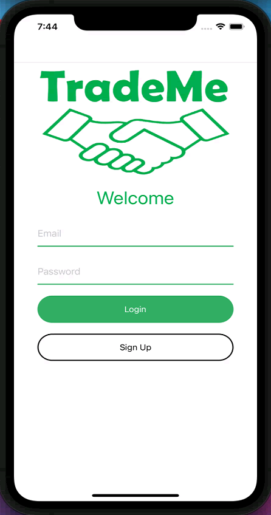 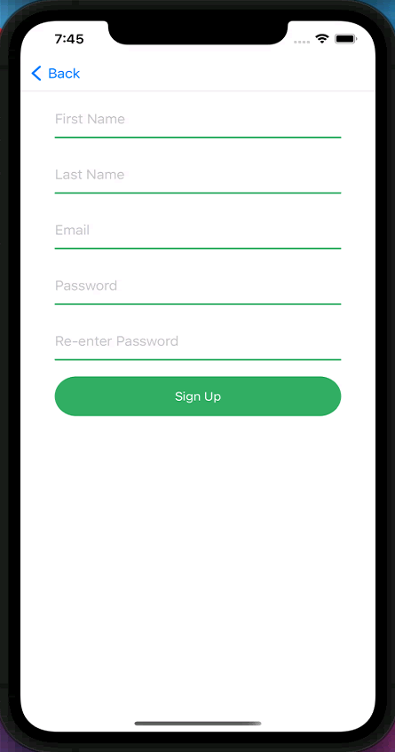

### Home Screen
A screen that shows all the existing products in the system of other users. You can see the details of the product owners and send them an offer.

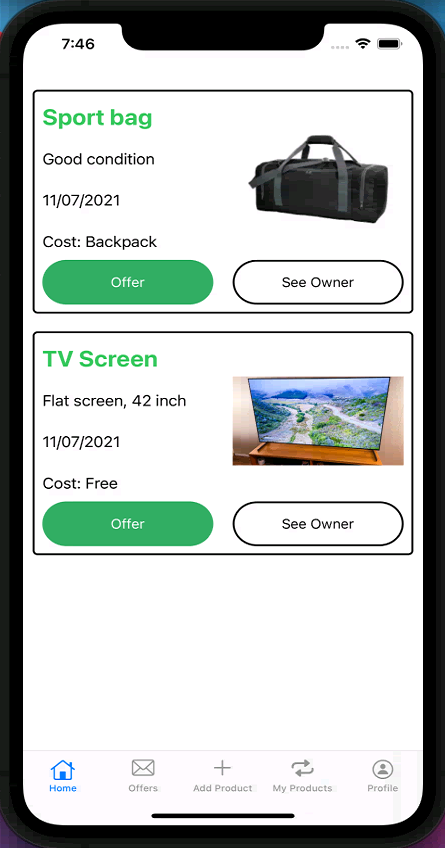 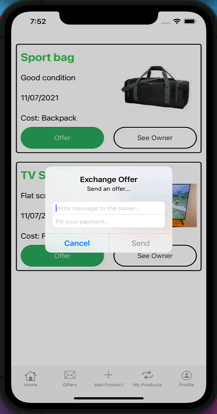 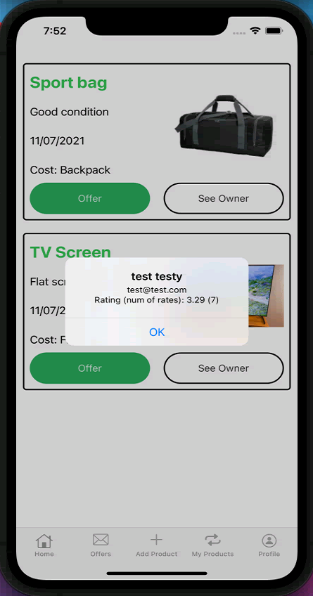

### Add Product Screen
A screen where you can advertise your product and upload it to the system.

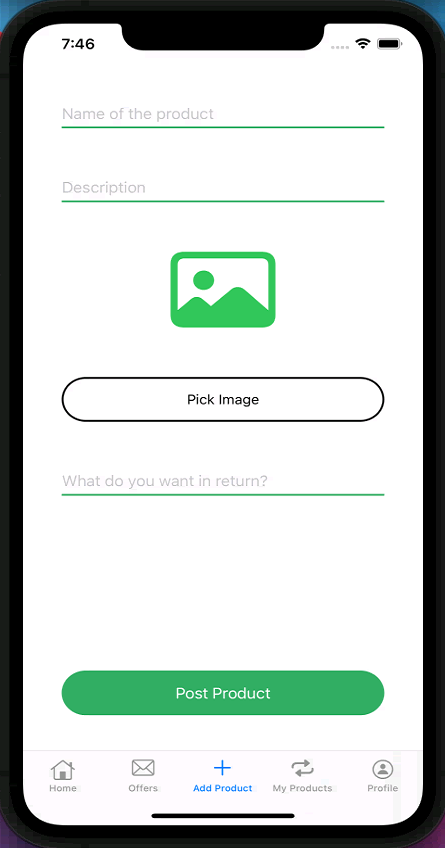  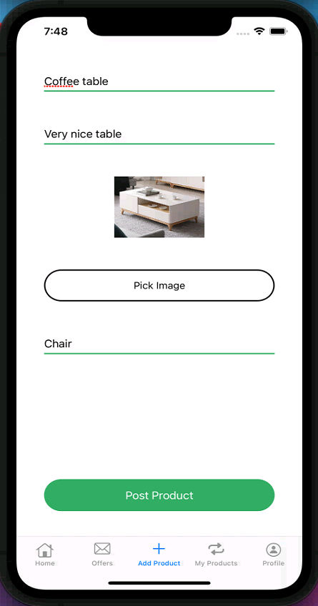

### My Products Screen
A screen which displays all the existing products of the user in the system.

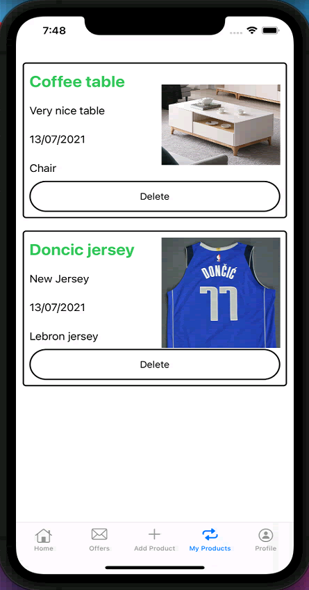

### Offers Screen
A screen that shows all the offers that have been sent to the user in the system, and the user can choose whether to refuse or accept.

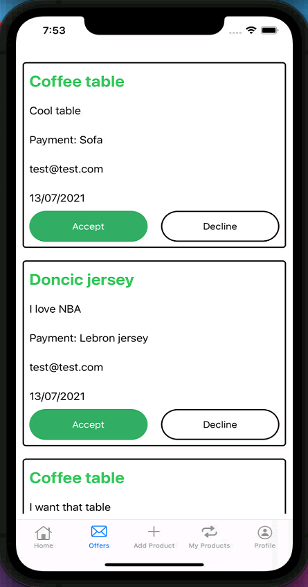

### Profile Screen
A screen that displays the user's information, rating and exchange history. The user can rate other users who have made exchanges with them.

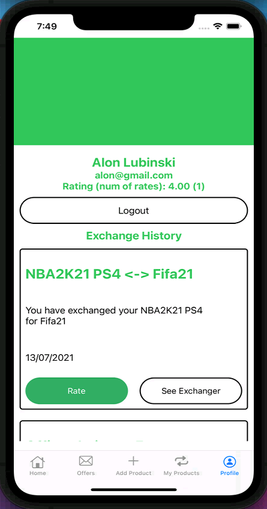 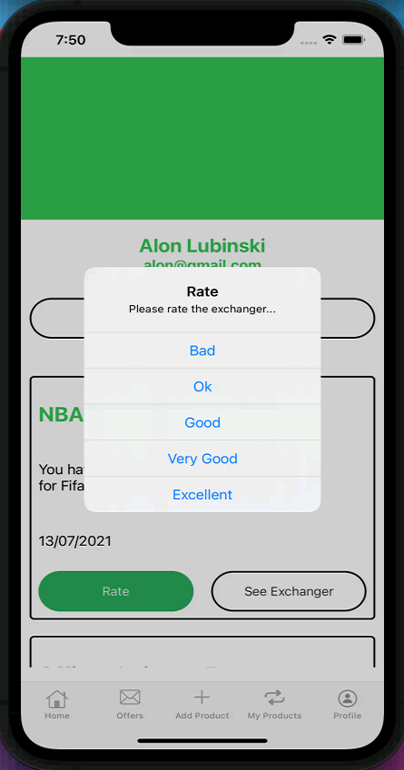 

